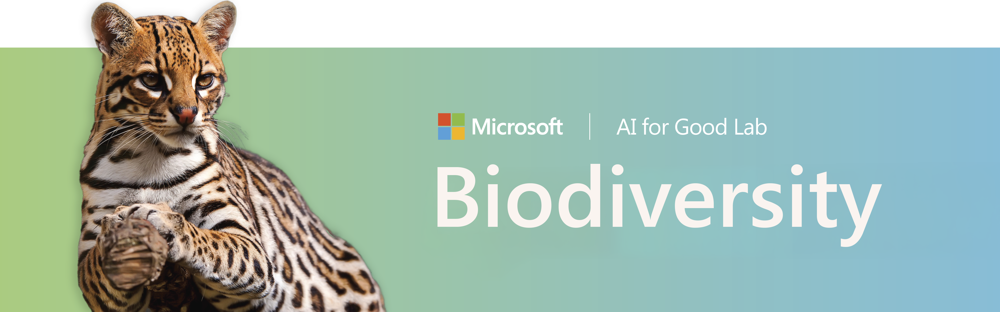

<div align="center">
<font size="6"> Open-source AI for camera traps, bioacoustics, and wildlife monitoring </font>
<br>
<hr>
<a href="https://github.com/microsoft/Biodiversity/blob/main/LICENSE"></a>
<a href="https://discord.gg/TeEVxzaYtm"></a>
<br><br>
</div>


## Welcome to Microsoft Biodiversity

**Microsoft Biodiversity** is the home for the AI for Good Lab's open-source conservation AI: a family
of projects for finding wildlife in imagery and audio, deploying models in the field, and building on a
shared framework. This hub ties the projects together and points you to the right starting point.

**Start here.** The [ecosystem guide](ecosystem.md) walks through every project and helps you choose by
what you already have (camera-trap images, audio recordings, a field device) or what you want to build.

## The ecosystem

- **[MegaDetector](https://microsoft.github.io/MegaDetector/)** detects animals, people, and vehicles in
  camera-trap images and filters out the blank frames.
- **[MegaDetector-Acoustic](https://microsoft.github.io/MegaDetector-Acoustic/)** classifies and identifies
  terrestrial species from audio recordings.
- **[SPARROW](https://microsoft.github.io/SPARROW/)** is the solar-powered edge device that runs these
  models on site in remote field deployments.
- **[PyTorch-Wildlife](https://microsoft.github.io/Pytorch-Wildlife/)** is the deep learning framework and
  model zoo that ties the ecosystem together in Python.

## The PyTorch-Wildlife framework

The PyTorch-Wildlife framework has its own home at
**[microsoft/Pytorch-Wildlife](https://github.com/microsoft/Pytorch-Wildlife)**
([documentation](https://microsoft.github.io/Pytorch-Wildlife/)). Install it with:

```
pip install PytorchWildlife
```

See the [framework documentation](https://microsoft.github.io/Pytorch-Wildlife/) for quick-start examples,
the model zoo, and the full API reference.

> **Coming from an older version?** OWL is now **MegaDetector-Overhead**, the bioacoustics module is now
> **MegaDetector-Acoustic**, and the repo moved from `microsoft/CameraTraps` to `microsoft/Biodiversity`
> (old links redirect automatically). See the [full naming changes](releases/release_notes.md#naming-changes)
> in the v1.3.0 release notes.

## Who uses these tools

Conservation teams around the world build on the ecosystem. See the [collaborators page](collaborators.md)
for organizations already using these tools, and the
[ecosystem documentation standards](ecosystem-standards.md) if you are bringing a new project into the family.
